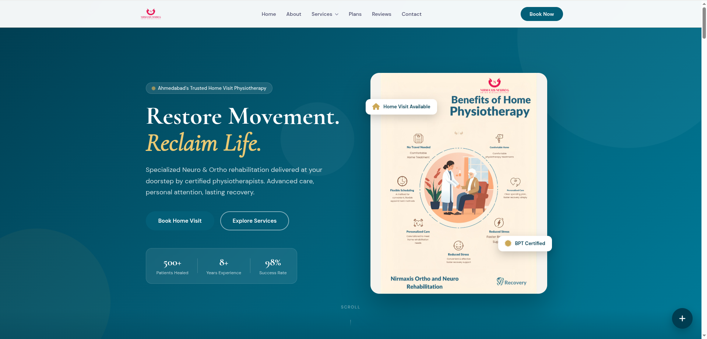
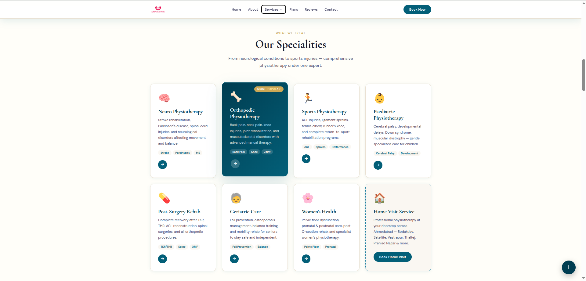
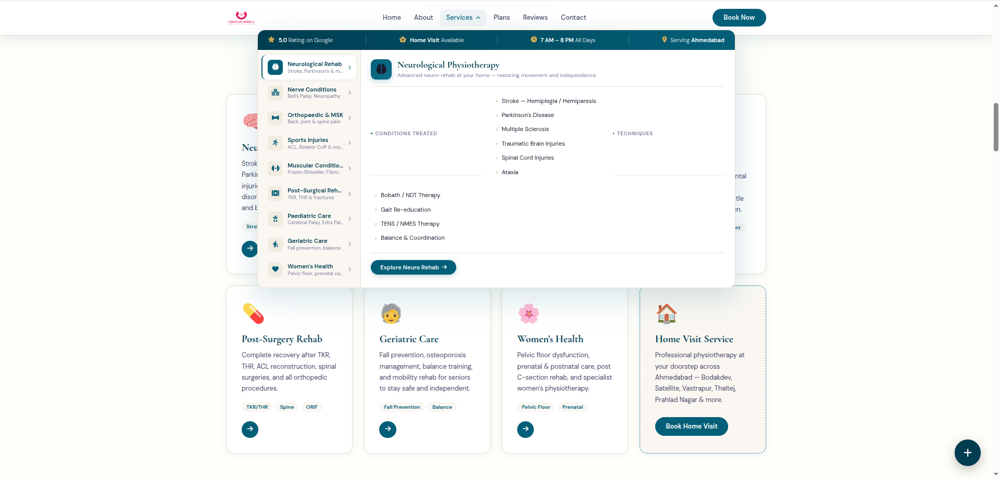
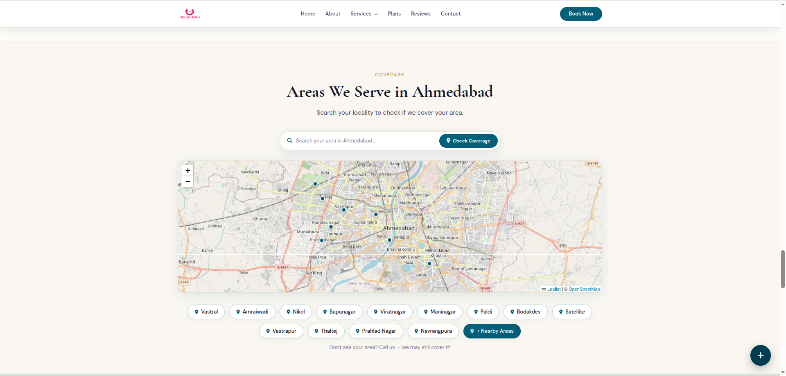
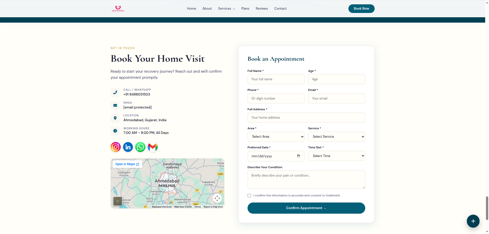

# NIRMAXIS — Neuro & Ortho Rehabilitation Website

> A professional, production-ready clinic website for a home-visit physiotherapy practice in Ahmedabad, India. Built entirely with vanilla HTML, CSS, and JavaScript — no frameworks, no build tools, just clean and fast frontend code.

[](https://YOUR_LIVE_URL_HERE)
[](https://github.com/YOUR_USERNAME/physio-clinic-saas)
[](./LICENSE)

---

## 📌 Project Description

**NIRMAXIS** is a fully responsive, single-page clinic website built for **Dr. Nirma Sankhla**, a specialist in Neurological and Orthopaedic rehabilitation offering home-visit physiotherapy across Ahmedabad, Gujarat.

### Problem It Solves
Many physiotherapy clinics lack a professional digital presence — relying solely on word-of-mouth. NIRMAXIS solves this by providing a high-trust, conversion-focused website that allows patients to:
- Discover the clinic's services and expertise
- Check if their area is covered via an interactive map
- Book an appointment directly through the site
- Get instant WhatsApp / call access from any page

### Target Users
- **Patients** seeking home-visit physiotherapy in Ahmedabad
- **Caregivers** managing neuro/ortho rehab for family members
- **Referring doctors** sending patients to a trusted specialist

---

## 🚀 Live Demo

| Environment | URL |
|---|---|
| Production | [https://YOUR_LIVE_URL_HERE](https://YOUR_LIVE_URL_HERE) |
| Local Dev | `http://127.0.0.1:5500/index.html` |

---

## ✨ Features

### Core Functionality
- **Premium 9-Tab Mega Menu** — Click-activated service dropdown (desktop) + full accordion (mobile)
- **Service Detail Modals** — 7 detailed service pop-ups with conditions, techniques, and booking CTAs
- **Appointment Booking Form** — Validated form with dual EmailJS emails + optional Google Sheets logging
- **Interactive Area Coverage Map** — OpenStreetMap + Leaflet.js with 45+ Ahmedabad locality search
- **Floating Quick-Action Panel** — Persistent Call / WhatsApp / Book shortcuts on every section
- **Animated Stats Counter** — Numbers count up when section enters the viewport
- **Scroll Reveal Animations** — Cards and sections animate in on scroll

### UX & Design
- Fully responsive — mobile, tablet, and desktop
- CSS custom property design system (teal, gold, cream palette)
- Cormorant Garamond + DM Sans typography pairing
- Smooth scroll, active nav highlighting, parallax hero effect

### Integrations
- EmailJS — dual appointment confirmation emails
- Google Sheets — optional booking database via Apps Script
- Google Analytics 4 — custom `appointment_booked` event tracking
- Google Search Console — SEO meta verification

---

## 🛠 Tech Stack

| Layer | Technology |
|---|---|
| **Markup** | HTML5 — semantic, accessible |
| **Styling** | CSS3 — custom properties, flexbox, grid, animations |
| **Scripting** | Vanilla JavaScript ES6+ |
| **Map** | [Leaflet.js 1.9.4](https://leafletjs.com/) + OpenStreetMap |
| **Icons** | [Font Awesome 6.5](https://fontawesome.com/) |
| **Fonts** | Google Fonts — Cormorant Garamond, DM Sans |
| **Email** | [EmailJS Browser SDK v3](https://www.emailjs.com/) |
| **Analytics** | Google Analytics 4 |
| **Hosting** | GitHub Pages / Netlify / Vercel |

> No Node.js, no npm, no build step required.

---

## 📸 Screenshots

| Section | Preview |
|---|---|
| Hero |  |
| Services Grid |  |
| Service Modal |  |
| Area Coverage Map |  |
| Booking Form |  |

> 📁 Add screenshots to a `./screenshots/` folder in the repo root.

---

## ⚙️ Installation & Setup

### Prerequisites
- [VS Code](https://code.visualstudio.com/) with the **Live Server** extension installed

### Step 1 — Clone
```bash
git clone https://github.com/y4shsec/physio-clinic-saas.git
cd physio-clinic-saas
```

### Step 2 — Run locally
```
1. Open project folder in VS Code
2. Right-click index.html → "Open with Live Server"
3. Site runs at http://127.0.0.1:5500
```

### Step 3 — Deploy

**GitHub Pages:**
```bash
git add .
git commit -m "deploy: production build"
git push origin main
# Settings → Pages → Deploy from main branch → root
```

**Netlify:** Drag the project folder to [app.netlify.com](https://app.netlify.com)

**Vercel:**
```bash
npm i -g vercel && vercel --prod
```

---

## 🔐 Environment Variables

No `.env` file — configuration is done directly in source files.

### `index.html`
```html
<!-- Replace in 2 places: -->
YOUR_GA4_MEASUREMENT_ID       → e.g. G-ABC123XYZ
YOUR_GSC_VERIFICATION_CODE    → from Google Search Console
```

### `js/main.js`
```javascript
emailjs.init("YOUR_PUBLIC_KEY");
emailjs.send("YOUR_SERVICE_ID", "YOUR_TEMPLATE_ID", data);

const SHEETS_ENDPOINT = "YOUR_APPS_SCRIPT_WEB_APP_URL";
```
---

## 📡 API Documentation

### EmailJS — Appointment Emails
```
Trigger  : Booking form submission
Emails   : 2 sent simultaneously (clinic + patient)
Payload  :
  {
    patient_name, phone, email, address,
    area, service, date, time, description
  }
```

### Google Sheets — Booking Log (Optional)
```
Type     : Google Apps Script Web App
Method   : POST  |  Mode: no-cors
Payload  : Same as EmailJS above
Response : { "status": "ok" }
```

### OpenStreetMap / Nominatim — Area Map
```
Map Tiles : https://{s}.tile.openstreetmap.org/{z}/{x}/{y}.png
Geocoding : https://nominatim.openstreetmap.org/reverse (on map click)
API Key   : Not required
Note      : Nominatim blocked on localhost via CORS —
            local 45-area database used as primary search source.
```

### Google Analytics 4
```
Custom Event : appointment_booked
Properties   : service_type, booking_area, event_category, event_label
Fired on     : Successful form submission
```

---

## 📁 Folder Structure

```
physio-clinic-saas/
│
├── index.html                   ← Single-page app entry point
│
├── css/
│   ├── style.css                ← Design system + all section styles
│   └── responsive.css           ← Mobile & tablet media queries
│
├── js/
│   └── main.js                  ← All JS — mega menu, modals,
│                                   form, map, animations, scroll
│
├── images/
│   ├── FullLogo_Transparent.png
│   ├── doctor.png
│   ├── physiotherapy.png
│   ├── certificate.png
│   ├── ig.png
│   ├── linkedin.png
│   ├── wp.png
│   └── mail.png
│
├── screenshots/                 ← Add your own screenshots here
│
└── README.md
```

---

## 🧠 Challenges & Learnings

### 1. Mega Menu clipped by `backdrop-filter` stacking context
**Problem:** `backdrop-filter: blur()` on the header creates a CSS stacking context that clips all `position: absolute` children to the header's own height.

**Solution:** Detached `mega-panel` from the header and appended it directly to `<body>`. Used `position: fixed` with JS-calculated `top` via `getBoundingClientRect()`.

---

### 2. Service modal opening on any page click
**Problem:** Clicking form inputs, blank sections, or buttons would randomly open the Neuro Physiotherapy modal.

**Root Cause:** The `megaPanel` div was `display: block` with `opacity: 0` — invisible but physically present in the DOM. At `position: fixed`, `width: 1020px`, `height: 552px`, it covered the entire visible page and intercepted all clicks. `elementFromPoint()` confirmed it was the top-most element everywhere on the page.

**Solution:** Added `display: none` to the base `.mega-panel` CSS rule (outside any media query). Removed all inline `style.display` manipulation from JS. Panel now fully exits the DOM when closed.

---

### 3. CORS errors with Nominatim on localhost
**Problem:** Nominatim blocked `fetch()` from `localhost` — breaking the area search with CORS policy errors.

**Solution:** Built a local JS database of 45+ Ahmedabad localities with coordinates. Search autocomplete runs entirely client-side — no network call, no CORS, instant results. Works on both localhost and production.

---

### 4. Scroll reveal creating invisible click traps
**Problem:** `IntersectionObserver` added `.reveal` (`opacity: 0`, no `pointer-events: none`) to interactive elements. Before the observer fired, these invisible elements intercepted clicks and triggered unexpected modals.

**Solution:** Added `pointer-events: none` to `.reveal` and `pointer-events: auto` to `.reveal.visible`. Removed service cards and area pills from the reveal selector — interactive elements should never start invisible.

---

## 🔮 Future Improvements

- [ ] Admin dashboard — view and manage bookings with password protection
- [ ] Blog / health tips section for SEO-driven organic traffic
- [ ] Gujarati and Hindi language support
- [ ] Razorpay integration for online session deposits
- [ ] Patient login portal with appointment history
- [ ] PWA support — offline access and home screen install
- [ ] WhatsApp Business API — auto-confirmation on booking
- [ ] Google Reviews live widget

---

## 👤 Author & Contact

**Yashdeep Sankhla** — Cybersecurity Professional & Freelance Web Developer  
Ahmedabad, Gujarat, India

| Platform | Link |
|---|---|
| GitHub | [github.com/YOUR_USERNAME](https://github.com/YOUR_USERNAME) |
| LinkedIn | [linkedin.com/in/YOUR_PROFILE](https://linkedin.com/in/YOUR_PROFILE) |
| Email | your.email@gmail.com |

**Client:** NIRMAXIS Neuro & Ortho Rehabilitation  
Dr. Nirma Sankhla, BPT — +91 84XXXX503 — Ahmedabad, Gujarat

---

## 📄 License

This project is **privately commissioned** for NIRMAXIS Neuro & Ortho Rehabilitation.

- ✅ The clinic may freely use, modify, and deploy this website
- ❌ Redistribution or reuse of this code/design without written permission is prohibited

---

<div align="center">
<strong>NIRMAXIS — Restoring Movement. Reclaiming Life.</strong><br>
<em>Built with precision for better patient care — Ahmedabad, Gujarat 🇮🇳</em>
</div>
